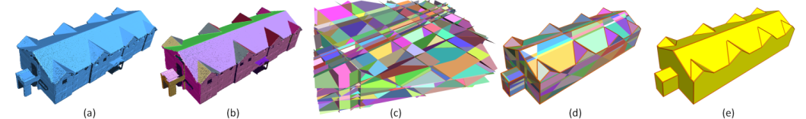
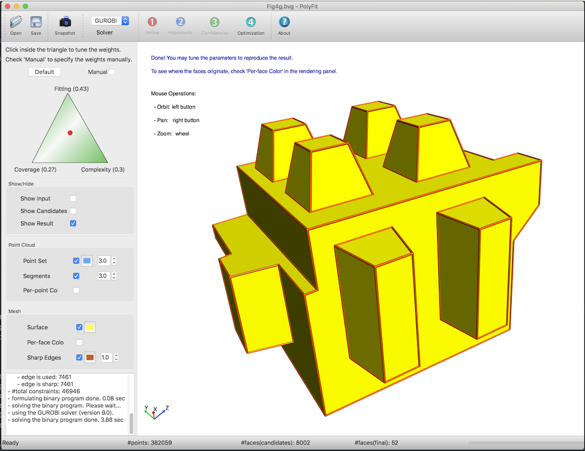

<p align="right">
    <b>  </b> <br>
    <b>  </b> <br> <br>
</p>


# Polygonal surface reconstruction from point clouds



<p align="center">PolyFit reconstruction pipeline</p>

PolyFit implements the hypothesis and selection based surface reconstruction method described in the following [paper](https://3d.bk.tudelft.nl/liangliang/publications/2017/polyfit/polyfit.html):
```
Liangliang Nan and Peter Wonka. 
PolyFit: Polygonal Surface Reconstruction from Point Clouds. 
ICCV 2017.
```
Please consider citing the above paper if you use the code/program (or part of it). 

---

### Obtaining PolyFit
Prebuilt executable files (for **macOS**, **Linux**, and **Windows**) are available [here](https://github.com/LiangliangNan/PolyFit/releases). 
  
You can also build PolyFit from the source code:
   
* Download the [source code](https://github.com/LiangliangNan/PolyFit).
* Dependencies
  - [Qt](https://www.qt.io/) (v5.8.0, v5.9.2, v5.10.1 have been tested)
  - [CGAL](http://www.cgal.org/index.html) (v4.10, v4.11.1 have been tested)
   
* Build PolyFit. 
  - There are many ways to build PolyFit. Choose one of the following (or whatever you are familiar with):
    - Option 1: Use any IDE that can directly handle CMakeLists files to open the CMakeLists.txt in the root directory of PolyFit. Then you should have obtained a usable project and just build. I recommend using [CLion](https://www.jetbrains.com/clion/) or [QtCreator](https://www.qt.io/product).
    - Option 2: Use CMake to generate project files for your IDE. Then load the project to your IDE and build.
    - Option 3: Use CMake to generate Makefiles and then `make` (on Linux/macOS) or `nmake`(on Windows with Microsoft Visual Studio). For example, on Linux or macOS, you can simply
        ```
        $ cd PolyFit
        $ mkdir Release
        $ cd Release
        $ cmake -DCMAKE_BULID_TYPE=Release ..
        $ make
        ```
    Don't have any experience with C/C++ programming? Have a look at [How to build PolyFit step by step](./How_to_build.md).

**News**: Since Aug. 5, 2019, PolyFit is also available in [CGAL](https://www.cgal.org/). Find more [here](https://www.cgal.org/2019/08/05/Polygonal_surface_reconstruction/).
  
---

### Run PolyFit
Super easy! This demo version provides a user interface with a few buttons (with numbered icons) and screen hints corresponding to these steps. Just click the buttons following the hints.

<p align="center"> 
      
</p>


---

### Data
Some test data can be downloaded from the [project page](https://3d.bk.tudelft.nl/liangliang/publications/2017/polyfit/polyfit.html).

More information about the data (e.g., data format) is described [here](https://github.com/LiangliangNan/PolyFit/blob/master/ReadMe-data.md).

**Plane extraction**. Incorporating plane extraction adds an unnecessary dependency to more third-party libraries (e.g., [RANSAC](http://cg.cs.uni-bonn.de/en/publications/paper-details/schnabel-2007-efficient/)). Besides, it has some randomness (due to the nature of RANSAC) and the data quality can vary a lot (it should be fine if some regions of the planes are missing). So I isolated this part from this demo version and you're expected to provide the planar segments as input. 

You can use my [Mapple](https://3d.bk.tudelft.nl/liangliang/software.html) to extract planes from point clouds. After you load the point cloud, go to the menu *Partition* -> *Extract Primitives*. To visualize the planes, change the renderer from 'Plain' to 'Group' in the Rendering panel (at the left side of Mapple). You can save the planes as bvg (**B**inary **V**ertex **G**roup) format. The ASCII format vg also works but slow. Please note, **PolyFit assumes that the model is closed and all necessary planes are provided**. 

---

### About the solvers
Four solvers, namely Gurobi, SCIP, GLPK, and lp_solve, are provided (with source code) in PolyFit. The Gurobi solver is more efficient and reliable and should always be your first choice. In case you want a fast but open source solver, please try SCIP, which is slower than Gurobi but acceptable. The GLPK and lp_solve solvers only manage to solve small problems. They are too slow (and may not guarantee to succeed). For example the data "Fig1", Gurobi takes only 0.02 seconds, while lp_solve 15 minutes. For your convenience, the dynamic library of Gurobi is included in this distribution, but you may still need to obtain a license (free for academic use) from [here](https://user.gurobi.com/download/licenses/free-academic). 
      
### About the timing
This demo implementation incorporates a progress logger in the user interface. Thus, running times should be (slightly) longer than those reported in our paper.  

---

### License
This program is free software; you can redistribute it and/or modify it under the terms of the GNU General Public License as published by the Free Software Foundation; either version 3 of the License or (at your option) any later version. The full text of the license can be found in the accompanying LICENSE file.

---

Should you have any questions, comments, or suggestions, please contact me at: 
liangliang.nan@gmail.com

**_Liangliang Nan_**

https://3d.bk.tudelft.nl/liangliang/

July 18, 2017

Copyright (C) 2017 
